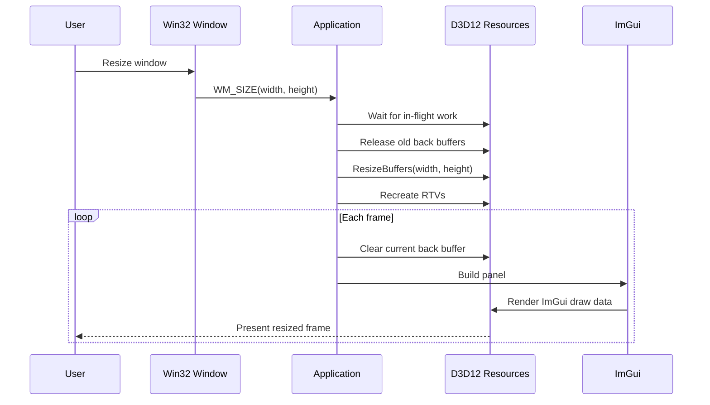
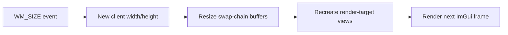

# Lesson 01: A Resizable DirectX 12 Window With ImGui

## Chapter 1: Why This Exists

Before the Local Frame Lab can draw vectors, axes, or draggable points, the project needs a place for those visuals to live.

This first step builds only the foundation:

- a native Win32 window
- a DirectX 12 device and swap chain
- a render loop that clears the back buffer
- an empty Dear ImGui panel
- real resize handling through `WM_SIZE`

The important lesson is that a window resize is not just a new number. In DirectX 12, the swap-chain back buffers are GPU resources. When the window's client area changes, those back buffers must be released and recreated.

## Chapter 2: What The User Sees

The app opens a dark resizable window with one ImGui panel named **Physics Sandbox**.

The panel shows:

- the current client area size
- the current back-buffer frame index
- ImGui's display size
- a reminder to resize the window

When the outer window is resized, the dark display area grows or shrinks. The ImGui panel keeps its own size unless the user resizes the panel itself.

## Chapter 3: The State Model

The application owns four groups of state:

| State group | What it owns |
|---|---|
| Win32 | `HWND`, current width, current height, minimized flag |
| D3D12 | device, command queue, swap chain, command list, fences |
| Back buffers | one render target resource and RTV descriptor per frame |
| ImGui | context plus a shader-visible descriptor heap for the font texture |

The simulation state is intentionally absent. This step is only the display foundation.

## Chapter 4: The Resize Rule

When Windows sends:

```text
WM_SIZE
```

the app extracts the new client-area dimensions:

\[
w = \operatorname{LOWORD}(lParam)
\]

\[
h = \operatorname{HIWORD}(lParam)
\]

Then, if DirectX 12 is already initialized and the window is not minimized, the app performs the resize sequence:

```text
wait for GPU
release old back-buffer resources
ResizeBuffers(width, height)
get new back buffers
recreate render-target views
continue rendering
```

This is the critical idea:

> The window changed size, so the GPU images we render into must change size too.

## Chapter 5: What To Watch For

Resize the window slowly. The expected behavior is:

- no crash
- no stretched stale frame
- no device-removed error
- the ImGui panel remains readable
- the displayed client size updates
- the dark render area fills the new client area

If the app only updated `width` and `height` but did not call `ResizeBuffers`, the swap chain would still contain old-size back buffers. That is the exact mismatch this lesson avoids.

## Chapter 6: What We Learned

- DirectX 12 is explicit: the app owns the resize work.
- `WM_SIZE` is the bridge from Win32 window events to GPU resource management.
- ImGui is drawn inside the same command list as the rest of the frame.
- The first useful architecture boundary is already visible: window events, GPU resources, ImGui UI, and future simulation state are separate concerns.

## What Comes Next

The next lesson can add the first Local Frame Lab visual: fixed world axes and one vector arrow `P`. The math can stay simple because this foundation already knows how to show UI and survive resize.

## Sequence Interaction Diagram



## Concept Diagram


