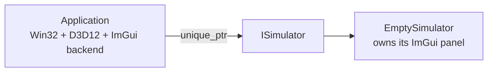

# Lesson 02: A Pluggable Simulator Interface

## Goal

Create a small simulator interface so the DirectX shell can stay stable while individual simulations can be swapped in code.

This is not plugin loading yet. There are no DLLs, manifests, runtime discovery rules, or dynamic module boundaries. For now, "pluggable" means:

- every simulator derives from the same C++ interface,
- the app stores the current simulator through a smart pointer,
- each simulator owns its own ImGui controls,
- changing the active simulator is one obvious code edit.

## Why This Shape

The window, swap chain, command queue, fences, and ImGui backend are infrastructure. They should not need to know what a vector simulator, orbit simulator, or field simulator is.

The simulator is the lesson/playground. It should know which controls matter, what needs to be drawn in ImGui, and which values are worth exposing.

That gives us this split:



## The Interface

The current interface is intentionally tiny:

```cpp
class ISimulator
{
public:
    virtual ~ISimulator() = default;

    [[nodiscard]] virtual const char* name() const noexcept = 0;
    virtual void render_ui(const SimulatorFrameContext& context) = 0;
};
```

The virtual destructor is the important RAII detail. It means the app can hold a `std::unique_ptr<ISimulator>` and still destroy the real derived simulator correctly.

## The Frame Context

The app passes a small read-only context into the simulator UI:

```cpp
struct SimulatorFrameContext
{
    unsigned int client_width = 0;
    unsigned int client_height = 0;
    unsigned int frame_index = 0;
    float imgui_display_width = 0.0f;
    float imgui_display_height = 0.0f;
};
```

This avoids making the simulator reach back into the DirectX app. The simulator gets enough information to label and size its UI, but it does not own the swap chain or window.

## The Swap Point

For now, changing simulators is supposed to be boring:

```cpp
std::unique_ptr<physics::sim::ISimulator> create_simulator()
{
    return std::make_unique<physics::sim::EmptySimulator>();
}
```

When the first real Chapter 3 simulator exists, this becomes:

```cpp
return std::make_unique<physics::sim::LocalFrameLabSimulator>();
```

That is the current meaning of pluggable.

## What Comes Next

Once a simulator needs animation or DirectX drawing, the interface can grow carefully:

- `update(float delta_seconds)` for time evolution,
- `render_scene(...)` for simulator-specific drawing,
- `on_resize(width, height)` if the simulator owns GPU resources that depend on size.

We are not adding those yet because the empty ImGui window does not need them.
