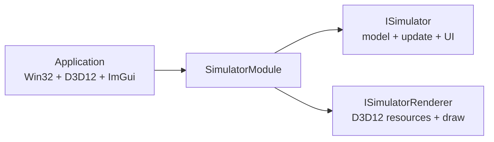

# Lesson 03: Simulator Modules And Renderer Pairs

## Goal

Adapt the Granny Sandbox 3 pattern for this physics sandbox:

- simulator code owns model state, update rules, and simulator-specific ImGui,
- renderer code owns D3D12 graphics configuration and draw commands,
- a simulator module pairs one simulator with one renderer.

This keeps the DirectX shell stable while letting each experiment choose the graphics style it actually needs.

## Why Not One Interface

A 2D vector grid and a 3D orbit scene do not want the same renderer. If `ISimulator` directly owns D3D12 drawing, every simulator becomes a mix of:

- physics/model behavior,
- lesson controls,
- root signatures,
- pipeline state objects,
- shaders,
- mesh or grid rendering.

That gets tangled fast.

The split is:



## Simulator Contract

`ISimulator` is model-facing:

```cpp
class ISimulator
{
public:
    virtual ~ISimulator() = default;

    virtual const char* name() const noexcept = 0;
    virtual void update(const SimulationTick& tick) = 0;
    virtual void render_ui(const SimulatorFrameContext& context) = 0;
};
```

The simulator owns its controls because only the simulator knows which sliders, buttons, diagnostics, and lesson notes matter.

## Renderer Contract

`ISimulatorRenderer` is graphics-facing:

```cpp
class ISimulatorRenderer
{
public:
    virtual ~ISimulatorRenderer() = default;

    virtual const char* name() const noexcept = 0;
    virtual void initialize(const RendererInitContext& context) = 0;
    virtual void on_resize(const RendererResizeContext& context) = 0;
    virtual void record_draw(const RendererFrameContext& context) = 0;
    virtual void render_ui() {}
};
```

The renderer owns its D3D12 resources. A 2D grid renderer, a wireframe renderer, and a full 3D scene renderer can have different root signatures, PSOs, shaders, buffers, and UI controls.

## Module Pairing

The module is the compatibility boundary:

```cpp
struct SimulatorModule
{
    std::unique_ptr<sim::ISimulator> simulator;
    std::unique_ptr<gfx::ISimulatorRenderer> renderer;
};
```

This avoids a global renderer list where every renderer is expected to work with every simulator. It also avoids a renderer selector inside a simulator module. Multiple modules can reuse the same renderer class, but each module still has one paired renderer.

Future modules can look like:

```text
Local Frame Lab
- LocalFrameSimulator
- LocalFrameGridRenderer

Orbit Lab
- OrbitSimulator
- Orbit3DRenderer

Wave Field Lab
- WaveFieldSimulator
- HeatmapRenderer
```

## Current Swap Point

For now the active module is created in `create_default_simulator_module()`.

When a simulator module changes, this function becomes the place to pair the simulator with its renderer.

## What The App Owns

The application still owns:

- Win32 window lifetime,
- D3D12 device and swap chain,
- command queue and frame fences,
- back-buffer transitions,
- ImGui backend setup,
- the active `SimulatorModule`.

That is the right boring core. The interesting physics and graphics variants live behind interfaces.
