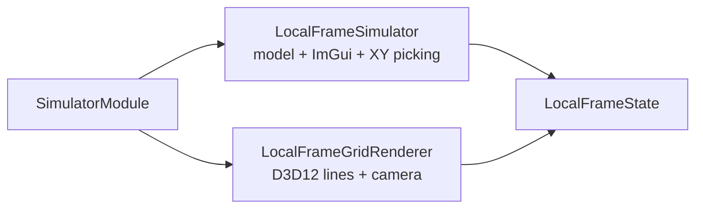

# Lesson 04: Local Frame Lab Stage 1

## Stage Goal

Build the first visible simulator: a vector `P` on the XY plane, drawn inside a 3D lattice.

This stage is intentionally simple:

- the world is already 3D,
- interaction is locked to the XY plane,
- the selected vector starts at `(3, 2, 0)`,
- ImGui can edit or reset the vector,
- clicking or dragging the scene background moves `P` on the XY plane.

## Why Start 3D But Lock To XY

The textbook problem can be introduced as a 2D vector problem, but this sandbox should grow into 3D frames, camera transforms, fields, and later relativity-adjacent observer frames.

So Stage 1 uses a 3D renderer immediately, but keeps the first idea constrained:

```text
P = (x, y, 0)
```

That makes `z` visible without making it a degree of freedom yet.

## The Formula

The selected vector is drawn from the origin to `P`.

Its magnitude is:

```text
|P| = sqrt(x^2 + y^2 + z^2)
```

In Stage 1:

```text
z = 0
```

So the live readout is really:

```text
|P| = sqrt(x^2 + y^2)
```

But the UI keeps the full 3D formula visible on purpose. The simulator is already teaching that 2D is a slice through a 3D space.

## What The User Can Do

Stage 1 controls:

- drag `P.x` and `P.y` with ImGui sliders,
- click **Reset P**,
- toggle component legs,
- toggle depth hints,
- click the scene background to move `P` on the XY plane,
- drag the scene background to continuously move `P`.

Stage 1 readouts:

- `P = (x, y, z)`,
- `|P|`,
- active plane,
- distance from the y-axis to `P`, shown as `|x|`,
- distance from the x-axis to `P`, shown as `|y|`,
- client area,
- elapsed time.

The main scene also labels:

- `P` with its live `x` and `y` values,
- the x-distance guide from the y-axis to `P`,
- the y-distance guide from the x-axis to `P`,
- the X, Y, and Z axis ends.

## Architecture

Stage 1 uses the simulator-module architecture:



The simulator and renderer share `LocalFrameState`.

The simulator owns:

- selected point/vector state edits,
- XY-plane click picking,
- ImGui controls and readouts.

The renderer owns:

- D3D12 root signature,
- pipeline state object,
- shader compilation,
- upload buffers,
- camera matrix,
- lattice, axes, vector, point marker, and component line drawing.

The depth hints are intentionally drawn only on the two back walls of the lattice. The accessible XY grid should stay open instead of being covered by foreground cage walls.

## Picking The XY Plane

Clicking the scene uses the renderer's inverse view-projection matrix.

The click begins as a mouse position in screen space:

```text
mouse = (screen_x, screen_y)
```

It is converted into normalized device coordinates:

```text
ndc_x = 2 screen_x / width - 1
ndc_y = 1 - 2 screen_y / height
```

Then the simulator unprojects a near and far point and intersects that ray with the XY plane:

```text
P(t) = near + t direction
z(t) = 0
```

Solving for `t`:

```text
t = -near.z / direction.z
```

The resulting `(x, y)` becomes the new vector endpoint, and `z` remains `0`.

## What We Learned

Stage 1 creates the first reusable Local Frame primitive:

- a 3D line renderer,
- a visible coordinate lattice,
- back-wall-only depth hints,
- world axes,
- a selected vector,
- component legs,
- measurement guide labels,
- XY-plane picking,
- magnitude diagnostics.

The key concept is still simple:

```text
The arrow is the object. The numbers are its description.
```

## Next Stage

Stage 2 adds plane slices:

- XY,
- XZ,
- YZ.

The vector will still be constrained, but the active constraint plane will become selectable. That turns the current XY-only interaction into a reusable plane-lock system.
