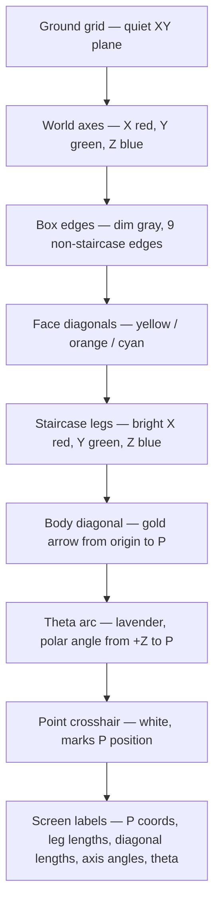
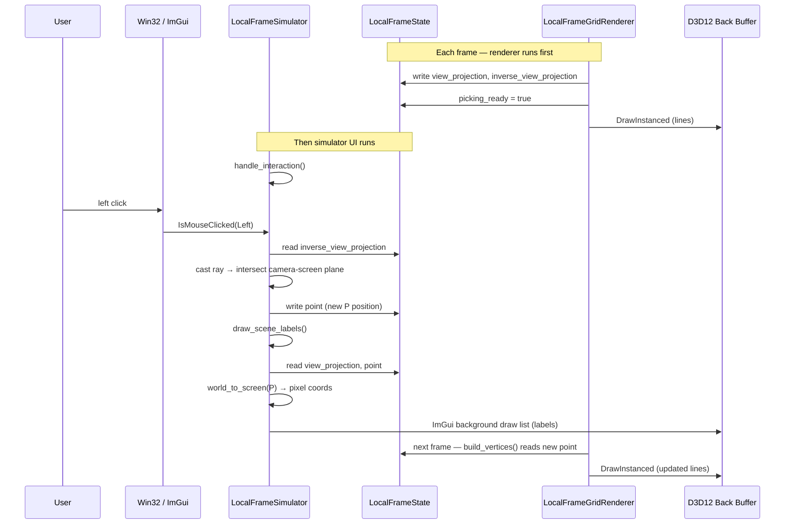
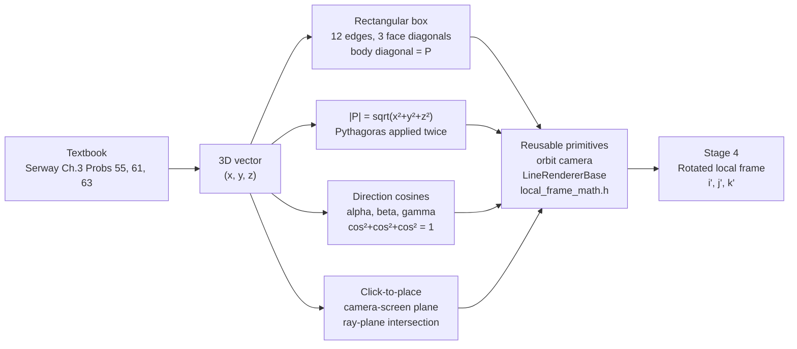
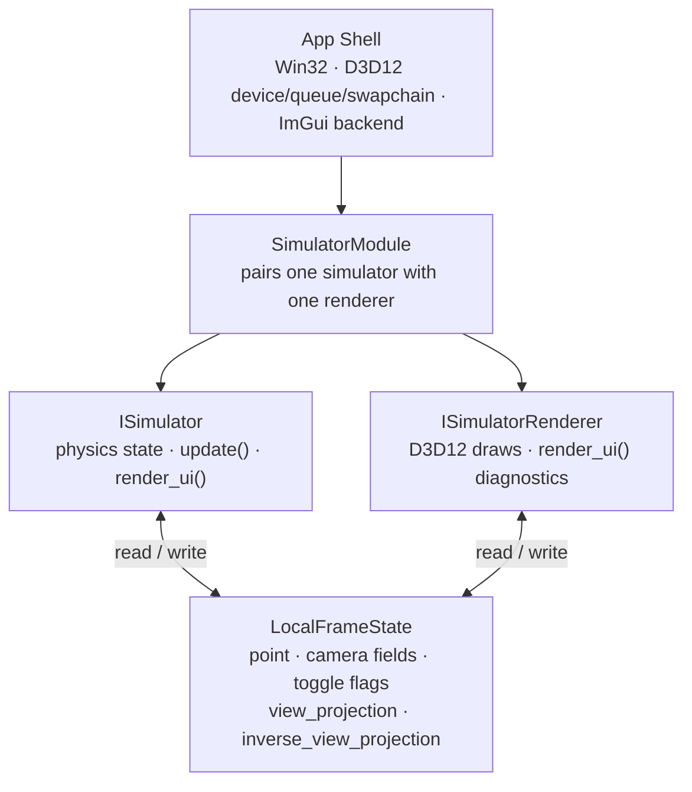
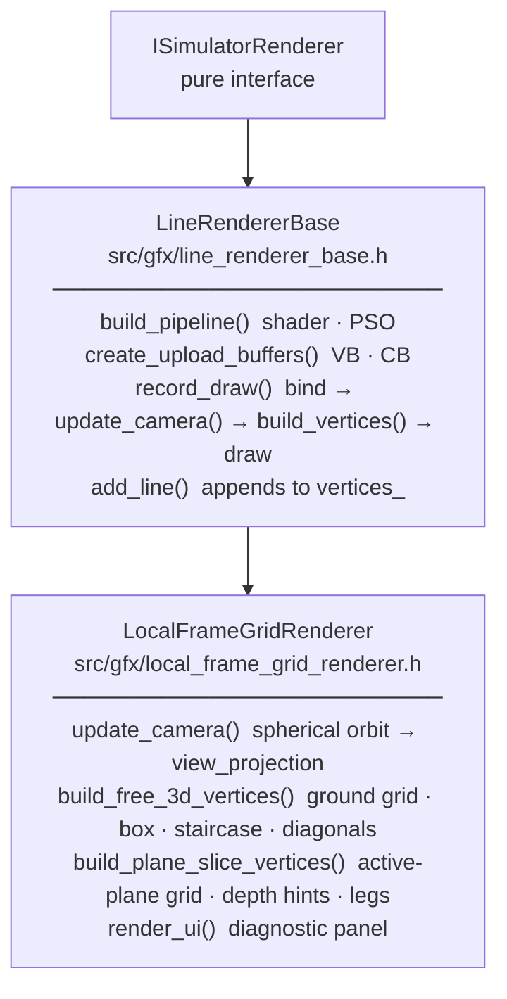
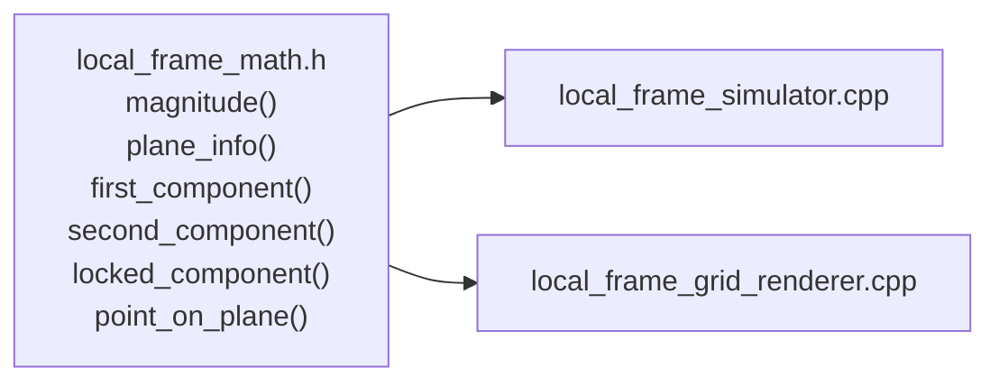

# Lesson 06 — Local Frame Lab Stage 3: Free 3D Vector

## Chapter 1: Why This Exists

Stage 2 showed that every 2D vector problem is a constrained slice through a 3D space.
Stage 3 removes the constraint.

The question this stage is designed to make visible is:

> Once a vector can point anywhere in 3D, what does it even mean to describe its direction?

There are two equivalent answers. The first is three components — how far the vector steps
along each world axis. The second is three angles — one between the vector and each axis.
The simulator shows both descriptions live, side by side, and lets the user watch them stay
consistent while dragging **P** anywhere in space.

This stage also introduces two tools that all future simulators will reuse: an orbit camera
and a `LineRendererBase` class that hides all D3D12 plumbing behind two override methods.

---

## Chapter 2: The Core Idea

### Magnitude and components in 3D

A vector **P** = (x, y, z) has magnitude:

\[
|P| = \sqrt{x^2 + y^2 + z^2}
\]

This is just Pythagoras applied twice — once in the XY plane, then once more along Z to
reach the tip.

### The staircase path

The three component legs form a staircase from the origin to **P**:

```
  Z
  │             P = (x, y, z)
  │            /◄── gold arrow (body diagonal = |P|)
  │      (x,y,z)
  │          │  ← blue leg |z|
  │      (x,y,0)
  │       ╱       ← green leg |y|
  │  (x,0,0)
  │╱             ← red leg |x|
  └─────────── Y
 ╱
X
```

Each leg is one axis-aligned step. Together they prove:
\[
|P|^2 = |x|^2 + |y|^2 + |z|^2
\]

### Direction cosine angles

The angle between **P** and each axis is a **direction cosine angle**:

\[
\alpha = \arccos\!\left(\frac{x}{|P|}\right), \quad
\beta  = \arccos\!\left(\frac{y}{|P|}\right), \quad
\gamma = \arccos\!\left(\frac{z}{|P|}\right)
\]

The quantities \(x/|P|\), \(y/|P|\), \(z/|P|\) are the **direction cosines**.
Squaring and adding them gives:

\[
\cos^2\alpha + \cos^2\beta + \cos^2\gamma
= \frac{x^2 + y^2 + z^2}{|P|^2} = 1
\]

The simulator shows this sum as a live readout. It is always 1.0000 for any nonzero **P**.

### The box and face diagonals

The box built around **P** has sides |x|, |y|, |z|. Its face diagonals and body diagonal
satisfy:

| Diagonal | Formula | Color |
|---|---|---|
| XY face diagonal | \(\sqrt{x^2+y^2}\) | yellow |
| XZ face diagonal | \(\sqrt{x^2+z^2}\) | orange |
| YZ face diagonal | \(\sqrt{y^2+z^2}\) | cyan |
| Body diagonal = \|P\| | \(\sqrt{x^2+y^2+z^2}\) | gold arrow |

This matches Serway/Beichner Problem 61. The body diagonal is exactly **P** — it is not a
separate thing, it is the vector.

---

## Chapter 3: What The User Sees

The viewport shows a 3D scene with a quiet XY ground grid, three colored world axes, and
a gold arrow from the origin to **P**.

### Controls

| Control | Effect |
|---|---|
| Left-click anywhere | Places **P** on the camera-screen plane through its current depth |
| Left-drag | Keeps **P** moving on that same plane |
| Right-drag | Orbits the camera |
| Scroll wheel | Zooms in / out |
| P.x / P.y / P.z sliders | Moves **P** along one axis while others stay fixed |
| Yaw / Pitch / Distance | Fine-tunes the orbit camera numerically |
| Legs checkbox | Staircase component legs (red X → green Y → blue Z) |
| Box checkbox | 12-edge rectangular box from origin to **P** |
| Face diags checkbox | Three face diagonals labeled with their lengths |
| Reset P | Returns **P** to (3, 2, 1.5) |
| Free 3D mode checkbox | Toggles back to Stage 2 plane-slice mode |

### Visual layers (from back to front)



---

## Chapter 4: The State Model

`LocalFrameState` is the shared contract between the simulator and the renderer.
The simulator writes some fields; the renderer writes others.

| Field | Owner | Role |
|---|---|---|
| `point` | Simulator | Position of **P** in world space |
| `active_plane` | Simulator | Which coordinate plane is locked (plane mode) |
| `free_3d_mode` | Simulator | Toggle between Stage 3 and Stage 2 behavior |
| `show_component_legs` | Simulator | Whether to draw the staircase |
| `show_box` | Simulator | Whether to draw the box |
| `show_face_diagonals` | Simulator | Whether to draw and label the face diagonals |
| `camera_yaw` | Simulator | Orbit angle around world Z |
| `camera_pitch` | Simulator | Elevation angle; clamped to [0.05, 1.50] rad |
| `camera_distance` | Simulator | Distance from origin to camera eye |
| `view_projection` | **Renderer** | VP matrix; used by simulator for screen-space labels |
| `inverse_view_projection` | **Renderer** | Inverted VP; used by simulator for ray casting |
| `viewport_width/height` | **Renderer** | Current client area; used by simulator for NDC→pixel |
| `picking_ready` | **Renderer** | True once the renderer has written the VP matrices |

The renderer writes `view_projection` and `inverse_view_projection` *before* `render_ui` runs each
frame, so the simulator's picking and label code always uses a current matrix.

---

## Chapter 5: The Key Formulas

### Orbit camera eye position

The camera always looks at the origin. Its position in world space is:

\[
\text{eye} = d
\begin{pmatrix}
\cos\phi\,\sin\theta \\
-\cos\phi\,\cos\theta \\
\sin\phi
\end{pmatrix}
\]

where \(d\) is the camera distance, \(\theta\) is yaw (rotation around Z), and \(\phi\) is
pitch (elevation). Z is world-up.

In code (`update_camera` in `local_frame_grid_renderer.cpp`):

```cpp
const float cp   = std::cos(state_->camera_pitch);
const float dist = state_->camera_distance;
const XMVECTOR eye = XMVectorSet(
    dist * cp * std::sin(state_->camera_yaw),
    dist * cp * (-std::cos(state_->camera_yaw)),
    dist * std::sin(state_->camera_pitch),
    1.0f);
```

### Click-to-place: ray–plane intersection

When the user left-clicks, the simulator casts a ray from the mouse through the scene and
intersects it with the **camera-screen plane** — the plane through **P**'s current position
whose normal is the camera look direction.

\[
t = \frac{\hat{n} \cdot (\mathbf{o} - \mathbf{r}_0)}{\hat{n} \cdot \hat{d}}
\]

where \(\hat{n}\) is the plane normal (camera look direction), \(\mathbf{o}\) is a point on
the plane (P's world position at click time), \(\mathbf{r}_0\) is the ray origin (near
plane), and \(\hat{d}\) is the ray direction. The new **P** is \(\mathbf{r}_0 + t\hat{d}\).

This means **P always stays at the same depth relative to the camera when dragged**. The plane
does not change during a drag — it is locked at the moment of click.

In code (`move_point_on_drag_plane` in `local_frame_simulator.cpp`):

```cpp
const float denom = n.x * ray_dir.x + n.y * ray_dir.y + n.z * ray_dir.z;
const float t = (n.x * (o.x - near_world.x) + ...) / denom;
state_->point = { near_world.x + ray_dir.x * t, ... };
```

### The polar angle θ

The direction cosines tell us how close the vector is to each axis, but they do not directly
give a single angle from one preferred axis. The **polar angle** θ picks the Z axis as the
reference:

\[
\theta = \arccos\!\left(\frac{z}{|P|}\right)
\]

This is the angle swept from +Z down to **P** in the vertical half-plane that contains both
Z and **P**. The simulator draws it as a lavender arc of radius 1.5 units, starting at the
+Z tip and ending at the point on the unit sphere in the direction of **P**.

\(\theta\) is not a new quantity — it is the same as \(\gamma\) (the direction cosine angle
with the Z axis). Writing it as \(\theta\) places **P** in standard spherical coordinates
\((r, \theta, \varphi)\):

| Symbol | Quantity | Formula |
|---|---|---|
| \(r\) | magnitude | \(\sqrt{x^2+y^2+z^2}\) |
| \(\theta\) | polar angle from +Z | \(\arccos(z/r)\) |
| \(\varphi\) | azimuthal angle from +X | \(\arctan(y/x)\) |

Only two independent angles are needed to fix a direction in 3D (the third is redundant once
the first two are known). The direction cosines \(\alpha, \beta, \gamma\) encode the same
information, spread across three quantities with the constraint
\(\cos^2\!\alpha + \cos^2\!\beta + \cos^2\!\gamma = 1\).

In code (`draw_scene_labels` in `local_frame_simulator.cpp`):

```cpp
const float theta = std::acos(std::clamp(z / pmag, -1.0f, 1.0f));
// arc midpoint at half-angle, radius 1.5, in the vertical plane of Z and P
const XMFLOAT3 arc_mid = {
    arc_r * std::sin(tmid) * (x / pxy),
    arc_r * std::sin(tmid) * (y / pxy),
    arc_r * std::cos(tmid),
};
```

What changes on screen: drag **P** toward +Z — the arc shrinks to zero. Drag **P** into
the XY plane (z = 0) — the arc opens to 90°. Drag below the XY plane — the arc exceeds
90° and approaches 180°.

---

## Chapter 6: What To Watch For

**The identity stays 1.**
Drag **P** anywhere. The `cos²+cos²+cos²` readout stays at 1.0000. This is not a rounding
coincidence — it is the Pythagorean theorem normalised by |P|².

**The face diagonals are the 2D magnitudes.**
Enable face diags and move **P** so that z = 0. The XY face diagonal equals |P|. That is
Stage 2 again, seen from inside Stage 3.

**The staircase always reaches P.**
No matter the angle or depth, the three colored legs follow P precisely. Each leg connects
one staircase corner to the next; their combined path is always exactly as long as
|x| + |y| + |z|, never shorter.

**Camera angle changes the drag plane.**
Orbit to a new viewpoint, then click. **P** now moves on a plane tilted to match the new
camera direction. The math in `move_point_on_drag_plane` recalculates the plane normal from
the current yaw and pitch every time a drag starts.

**θ and γ are the same angle.**
The lavender arc shows θ = arccos(z/|P|). The readout labelled `gamma (with Z)` in the
panel shows γ in degrees. They are always equal — θ is just the spherical-coordinate name
for the same angle. Drag **P** until the arc opens to exactly 90°: z must be zero and the
panel will confirm γ = 90°.

**Depth is preserved during a drag.**
Once a drag begins, the plane is fixed. If the user orbits mid-drag (they can't — left and
right mouse buttons are independent) **P** would not follow. The plane is intentionally
frozen at click time to give stable, predictable motion.

---

## Chapter 7: What We Learned

- A 3D vector's direction is fully described by either (x, y, z) or the three direction
  cosine angles. Both are the same fact.
- The direction cosine identity \(\cos^2\alpha+\cos^2\beta+\cos^2\gamma=1\) is Pythagoras
  normalised. It cannot fail for a nonzero vector.
- The box and staircase make the Pythagorean decomposition physical: you can see the legs
  that the formula is adding.
- A camera-screen drag plane is a natural and intuitive way to move a 3D point with a 2D
  mouse. The depth of the point is implicit in the plane.

---

## What Comes Next

**Stage 4: Rotated Local 3D Frame**

The world axes will grow a second set of axes — **i'**, **j'**, **k'** — that can be
rotated independently. **P** stays fixed. Its world-frame coordinates (x, y, z) will not
change. But its local-frame coordinates (x', y', z') will change as the basis rotates.

That is the central idea of coordinate transforms: the vector is not moving; the ruler is.

---

## Sequence Interaction Diagram

This diagram shows what happens from a left-click through to the updated scene label.



---

## Concept Diagram



---

## Architecture Diagram

### The sandbox module pattern



### The line renderer inheritance chain



To add a renderer for a new simulator: inherit `LineRendererBase`, implement
`update_camera()`, `build_vertices()`, `name()`, and `render_ui()`. No D3D12 boilerplate.

### Per-frame data flow

```mermaid
sequenceDiagram
    participant Loop as Win32 message loop
    participant Mod as SimulatorModule
    participant Sim as ISimulator
    participant Rend as ISimulatorRenderer

    Loop->>Mod: tick(dt)
    Mod->>Sim: update(tick)
    Note over Sim: advance time, no rendering

    Mod->>Rend: record_draw(context)
    Note over Rend: update_camera() → writes VP to state
    Note over Rend: build_vertices() → add_line() × N
    Note over Rend: DrawInstanced

    Mod->>Sim: render_ui(context)
    Note over Sim: handle_interaction() — reads VP from state
    Note over Sim: draw_scene_labels() — world_to_screen × M
    Note over Sim: ImGui::Begin … End
```

### Shared math: `local_frame_math.h`

Before Stage 3, both `local_frame_simulator.cpp` and `local_frame_grid_renderer.cpp`
carried private copies of the plane helper functions. Stage 3 extracted them into one
inline header both files include.


