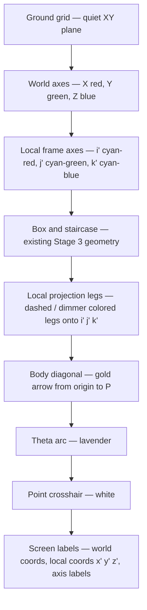
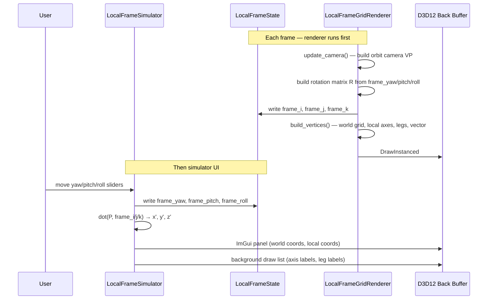
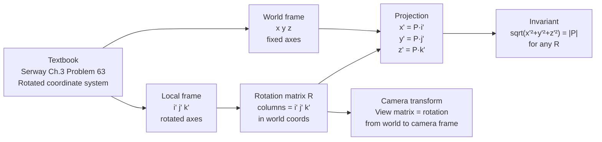

# Lesson 07 — Local Frame Lab Stage 4: Rotated Local Frame

## Chapter 1: Why This Exists

Stage 3 showed P in a world frame — three fixed axes, one fixed ruler.
Stage 4 adds a second ruler: a local frame **i'**, **j'**, **k'** that can be rotated
independently while P stays fixed.

The question this stage is designed to make visible is:

> If the vector does not move, but the axes rotate, what happens to its coordinates?

The answer is the core of every coordinate transform in physics and graphics:
*the vector is not changing — only the description of it changes.*
This is the same transformation used by every camera matrix, every rotating reference frame,
and every tensor component rule. Stage 4 makes that transformation touchable.

---

## Chapter 2: The Core Idea

### The world frame and the local frame

The world frame has orthonormal basis vectors:

\[
\hat{x} = (1,0,0) \quad \hat{y} = (0,1,0) \quad \hat{z} = (0,0,1)
\]

The local frame has a second orthonormal basis, rotated by some angles relative to the world:

\[
\hat{i}' \quad \hat{j}' \quad \hat{k}'
\]

Both frames share the same origin. The vector **P** is the same physical arrow in both.

### The rotation matrix

A rotation matrix **R** carries the world axes into the local axes:

\[
\hat{i}' = R\,\hat{x} \qquad \hat{j}' = R\,\hat{y} \qquad \hat{k}' = R\,\hat{z}
\]

The columns of **R** in the world frame are exactly \(\hat{i}'\), \(\hat{j}'\), \(\hat{k}'\).
This means **R** is just the matrix whose columns are the local basis vectors.

In this simulator **R** is built from three successive rotations — yaw (around world Z),
then pitch (around the new Y), then roll (around the new X) — using DirectX's
`XMMatrixRotationRollPitchYaw`:

\[
R = R_z(\psi)\,R_y(\phi)\,R_x(\theta)
\]

### Local coordinates by projection

Once the basis vectors are known, the local coordinates of **P** are dot products:

\[
x' = \mathbf{P} \cdot \hat{i}' \qquad
y' = \mathbf{P} \cdot \hat{j}' \qquad
z' = \mathbf{P} \cdot \hat{k}'
\]

These three numbers locate **P** in the local frame exactly as (x, y, z) locate it in the
world frame. When the local frame is aligned with the world frame, \(x' = x\), \(y' = y\),
\(z' = z\). As the frame rotates, the numbers change — even though **P** has not moved.

### The spatial picture

```
  Z / k'                     P
  │     k'╲                 ╱ (gold arrow)
  │         ╲              ╱
  │          ╲  ╱‾‾‾‾‾‾  ╱  ← local z' leg (projection onto k')
  │           ╲╱         ╱
  │            origin   ╱
  │           ╱         ╲
  │      j'─╱            ╲ ← local y' leg (projection onto j')
  └──────────────── Y
 ╱
X   i' rotated off the X axis → local x' leg
```

The three local legs (projections) are the staircase of Stage 3, but built with a rotated
ruler. Their lengths are x', y', z'.

---

## Chapter 3: What The User Sees

### Controls

| Control | Effect |
|---|---|
| Yaw slider | Rotates the local frame around world Z |
| Pitch slider | Rotates the local frame around its own Y after yaw |
| Roll slider | Rotates the local frame around its own X after yaw+pitch |
| Reset frame | Returns local frame to world alignment (x'=x, y'=y, z'=z) |
| Show local axes | Toggles the three colored local axis arrows |
| Show local legs | Toggles the projection legs from P onto the local axes |
| (Existing P controls) | Sliders, drag, orbit camera all unchanged |

### Visual layers (back to front)



### What to look for

Rotate the local frame slowly from world alignment.
Watch the x', y', z' readouts drift away from x, y, z.
Notice that \(\sqrt{x'^2 + y'^2 + z'^2} = |P|\) always — the magnitude is frame-invariant.

---

## Chapter 4: The State Model

New fields added to `LocalFrameState` for Stage 4:

| Field | Owner | Role |
|---|---|---|
| `frame_yaw` | Simulator | Yaw angle of the local frame (around world Z), radians |
| `frame_pitch` | Simulator | Pitch angle of the local frame, radians |
| `frame_roll` | Simulator | Roll angle of the local frame, radians |
| `frame_i` | Renderer | Local X axis i' in world space — written each frame from rotation |
| `frame_j` | Renderer | Local Y axis j' in world space |
| `frame_k` | Renderer | Local Z axis k' in world space |
| `show_local_axes` | Simulator | Toggle for the three local axis arrows |
| `show_local_legs` | Simulator | Toggle for the projection legs |

`frame_i`, `frame_j`, `frame_k` are written by the renderer inside `update_camera` (same
pattern as `drag_plane_right/up`) so that the simulator can use them for coordinate readouts
without re-doing the rotation math.

Existing fields `point`, camera fields, and all Stage 3 toggles are unchanged.

---

## Chapter 5: The Key Formulas

### Building the rotation matrix

```cpp
const XMMATRIX R = XMMatrixRotationRollPitchYaw(
    state_->frame_pitch,   // pitch around X
    state_->frame_yaw,     // yaw   around Y   (DirectX RPY convention: pitch, yaw, roll)
    state_->frame_roll);   // roll  around Z

// Extract columns — these are the local axes in world space
const XMVECTOR i_prime = XMVector3Normalize(XMVector3TransformNormal(
    XMVectorSet(1,0,0,0), R));
const XMVECTOR j_prime = XMVector3Normalize(XMVector3TransformNormal(
    XMVectorSet(0,1,0,0), R));
const XMVECTOR k_prime = XMVector3Normalize(XMVector3TransformNormal(
    XMVectorSet(0,0,1,0), R));

XMStoreFloat3(&state_->frame_i, i_prime);
XMStoreFloat3(&state_->frame_j, j_prime);
XMStoreFloat3(&state_->frame_k, k_prime);
```

### Computing local coordinates

\[
x' = \mathbf{P} \cdot \hat{i}', \quad
y' = \mathbf{P} \cdot \hat{j}', \quad
z' = \mathbf{P} \cdot \hat{k}'
\]

```cpp
const XMVECTOR P = XMLoadFloat3(&state_->point);
const float xp = XMVectorGetX(XMVector3Dot(P, XMLoadFloat3(&state_->frame_i)));
const float yp = XMVectorGetX(XMVector3Dot(P, XMLoadFloat3(&state_->frame_j)));
const float zp = XMVectorGetX(XMVector3Dot(P, XMLoadFloat3(&state_->frame_k)));
```

What changes on screen: drag P — x', y', z' change as expected. Now reset P and rotate the
frame — x', y', z' change while x, y, z stay frozen. That is the lesson.

### Drawing a local axis arrow

Each axis arrow goes from the origin out to `axis_length * i'` (or j', k'). A small
arrowhead tick can be drawn as two short lines forking from the tip. Suggested length: 5
units (slightly shorter than the world axes at 6.5).

### Drawing a local projection leg

The projection of P onto axis i' is the point:

\[
\text{foot}_i = x' \cdot \hat{i}'
\]

The leg is a line from `foot_i` to P. (Optionally also a line from origin to `foot_i`.)

---

## Chapter 6: What To Watch For

**Magnitude is invariant.**
Rotate the frame to any orientation. The readout
\(\sqrt{x'^2 + y'^2 + z'^2}\) always equals \(|P|\). Coordinates change; length does not.
This is the geometric definition of an orthogonal transformation.

**World alignment is the identity.**
Reset the frame (all angles = 0). The local coordinates match the world coordinates exactly:
x' = x, y' = y, z' = z. The two staircases — world legs and local legs — overlap perfectly.

**90° yaw is a permutation.**
Rotate yaw by 90°. What was x becomes y' (or -y'); what was y becomes -x' (or x'). The
components shuffle — the vector has not moved.

**The local axes stay orthogonal.**
No matter how the frame is rotated, i', j', k' are always mutually perpendicular and unit
length. They are always a valid basis. The rotation matrix guarantees this because **R** is
orthogonal: \(R^T R = I\).

---

## Chapter 7: What We Learned

- A vector's coordinates depend on the chosen basis, not on the vector itself.
- The rotation matrix **R** transforms basis vectors; its columns are the new axes in world
  coordinates.
- Local coordinates are computed by projection (dot product): \(x' = P \cdot \hat{i}'\).
- Magnitude is invariant under rotation. The Pythagorean identity holds in every orthonormal
  frame.
- This is the same operation used by every view matrix in a 3D renderer: the camera defines
  a rotated local frame, and the scene's world coordinates are projected into it to get view
  coordinates.

---

## What Comes Next

Stage 4 is the natural stopping point for Chapter 3 of the textbook. The Local Frame Lab
has now covered:

1. 2D vectors on a coordinate plane (Stage 1)
2. Coordinate plane selection — 2D slices through 3D (Stage 2)
3. Free 3D vector — magnitude, direction cosines, spherical angle (Stage 3)
4. Rotated local frame — coordinate transforms (Stage 4)

The next simulator will likely introduce time (kinematics) or forces (Newton's laws), moving
from pure geometry into dynamics.

---

## Sequence Interaction Diagram



---

## Concept Diagram



---

## Build Guide

This section maps each visual and formula from the lesson to a specific file and location.
Work through it in order — each step is testable on its own.

---

### Step 1 — State fields

**File:** `src/sim/local_frame_state.h`

Add inside `LocalFrameState`, after the existing Stage 3 fields:

```cpp
// Stage 4: rotated local frame
float frame_yaw   = 0.0f;
float frame_pitch = 0.0f;
float frame_roll  = 0.0f;
bool show_local_axes = true;
bool show_local_legs = true;

// Written by renderer each frame — local axes in world space
DirectX::XMFLOAT3 frame_i = {1.0f, 0.0f, 0.0f};
DirectX::XMFLOAT3 frame_j = {0.0f, 1.0f, 0.0f};
DirectX::XMFLOAT3 frame_k = {0.0f, 0.0f, 1.0f};
```

**Test:** builds with no errors. No visual change yet.

---

### Step 2 — Compute and publish the rotation in the renderer

**File:** `src/gfx/local_frame_grid_renderer.cpp`, inside `update_camera()`, after the
existing view/projection matrix block.

Add the rotation matrix computation and store the three basis vectors to state. See Chapter 5
for the exact `XMMatrixRotationRollPitchYaw` call and the `XMVector3TransformNormal` extractions.

**Test:** run, inspect a debug `ImGui::Text` showing `frame_i` — it should be (1,0,0) when all
angles are zero.

---

### Step 3 — Draw local axis arrows

**File:** `src/gfx/local_frame_grid_renderer.cpp`, inside `build_free_3d_vertices()`.

Add three arrows (lines from origin to `5 * frame_i/j/k`). Use distinct colors — suggested:
slightly desaturated / brighter variants of the world-axis colors so they read as "the same
idea but different frame." Add arrowhead ticks (two short forks at the tip).

**Test:** run with all angles zero — local axes should sit exactly on top of world axes.
Rotate yaw slider — local axes should rotate while world axes stay fixed.

---

### Step 4 — Simulator UI: rotation sliders and local coordinate readouts

**File:** `src/sim/local_frame_simulator.cpp`, inside `render_free_3d_ui()`.

Add a `ImGui::Separator()` then:
- Three `ImGui::SliderFloat` for `frame_yaw`, `frame_pitch`, `frame_roll` (range −π to π)
- A `Reset frame` button that zeros all three
- Checkboxes for `show_local_axes` and `show_local_legs`
- A separator then the local coordinate readouts: `x' = P·i'`, computed inline using the
  dot product formula from Chapter 5
- Show the magnitude check: `sqrt(x'²+y'²+z'²)` alongside `|P|`

**Test:** move sliders, watch x'/y'/z' change while P stays fixed and `|P|` stays constant.

---

### Step 5 — Draw local projection legs

**File:** `src/gfx/local_frame_grid_renderer.cpp`, inside `build_free_3d_vertices()`,
gated on `state_->show_local_legs`.

For each axis:
- Compute `foot = dot(P, axis) * axis` (the foot of the perpendicular from P to the axis line)
- Draw a line from origin to `foot` (the "reach" along the local axis)
- Draw a line from `foot` to P (the remaining leg, perpendicular to the axis)

Use the same color as the local axis arrow, but at lower alpha so it reads as subordinate
geometry.

**Test:** with frame at world alignment, local legs overlap the Stage 3 world legs exactly.
Rotate frame — local legs pivot with it while world legs stay.

---

### Step 6 — Screen labels for local coordinates

**File:** `src/sim/local_frame_simulator.cpp`, inside `draw_scene_labels()`, in the
`free_3d_mode` branch.

For each local axis foot:
- Project `foot_i`, `foot_j`, `foot_k` to screen with `world_to_screen`
- Draw label `x' = ±N.NN` (matching the local axis color)

**Test:** labels follow P as it moves; labels also change as the frame rotates even when P
is stationary.

---

### Step 7 — Lesson and stage catalog

**File:** `docs/lesson-07-local-frame-stage-04-rotated-local-frame.md` — this file.

**File:** `docs/local-frame-lab-stage-catalog.md` — add Stage 4 lesson reference.

Check: the lesson doc describes everything that is now visible in the app.
