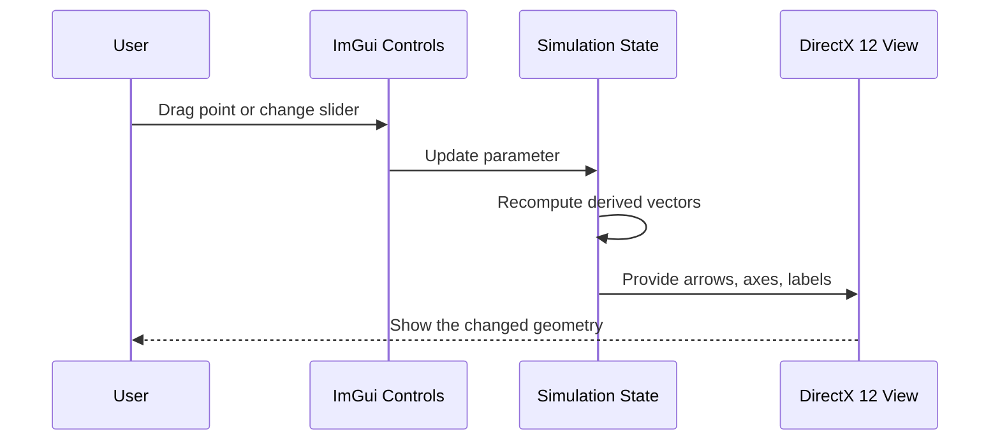
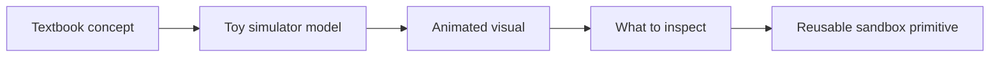

# Lesson Authoring Guide

## Purpose

This guide defines how lessons should be created for this physics sandbox. It adapts the teaching style from the Granny's House Trials learning projects to this workspace.

The goal is to build simulators bit by bit, with lessons that explain the shape of the simulator before asking the user to write or inspect code. A lesson should make the next small build step feel inevitable.

## Core Teaching Style

Lessons should be:

- **why-first**: explain why this simulator or step exists before implementation details
- **from first principles**: do not assume the user already sees the simulator shape
- **chaptered**: break the lesson into named chapters with a clear narrative arc
- **visual**: include diagrams, animation ideas, vector/path/frame sketches, or Mermaid diagrams
- **formula-aware**: include the relevant formulas in Markdown/LaTeX when they clarify the simulator
- **causal**: explain how state changes flow through the system
- **inspectable**: name what the user should see, drag, tune, measure, or compare
- **small-step**: one lesson should introduce one main idea or one build increment
- **honest**: separate real math/physics from toy model behavior and speculative extension

The user may understand the math problem but still not understand the simulator. Lessons must bridge that gap.

## Standard Lesson Shape

Use this structure for simulator lessons unless there is a strong reason not to.

```text
# Lesson NN: [Name]

## Chapter 1: Why This Exists
Explain the intuition, the project role, and what this simulator is trying to make visible.

## Chapter 2: The Core Idea
Explain the physics/math concept in plain terms.

## Chapter 3: What The User Sees
Describe the viewport, controls, animation, and readouts.

## Chapter 4: The State Model
Name the data that exists in the simulator.

## Chapter 5: The Update Or Transform Rule
Show the one equation or operation that drives the lesson.

## Chapter 6: What To Watch For
Describe the expected visual behavior and likely confusion points.

## Chapter 7: What We Learned
Summarize the reusable idea.

## What Comes Next
Name the next build step or next lesson.

## Sequence Interaction Diagram
Use Mermaid when runtime behavior or component interaction matters.

## Concept Diagram
Use Mermaid or an ASCII sketch for the visual mental model.
```

Not every lesson needs every section, but most simulator lessons should include the chaptered explanation, a "What We Learned" recap, and at least one diagram.

## Lesson Voice

Use plain, direct language. Avoid sounding like a formal paper.

Good lesson phrasing:

> The point is not to solve the textbook problem again. The point is to make the hidden shape of the idea visible.

> The vector is not changing. The coordinate frame is changing. That is why the numbers move while the arrow stays still.

> This is a toy model, but the distinction it teaches is real.

Avoid:

- proof-heavy explanations before the user knows what they are looking at
- long textbook summaries
- dumping equations without a visual goal
- treating implementation as the first chapter
- presenting speculative physics as established physics

## Formulas

Include formulas when they help connect the textbook problem, the simulator state, and the live readouts. Prefer Markdown math using LaTeX syntax.

Use inline math for short expressions:

```markdown
The vector magnitude is \( |v| = \sqrt{x^2 + y^2} \).
```

Use display math for formulas the simulator is built around:

```markdown
\[
x' = x\cos\alpha + y\sin\alpha
\]

\[
y' = -x\sin\alpha + y\cos\alpha
\]
```

Good lesson formulas should be paired with plain-language meaning:

```markdown
\[
v = \frac{dP}{dt}
\]

This says velocity is the rate at which the position vector changes as time moves.
```

When a formula directly maps to code, include a small code-shaped version too:

```cpp
Vec2 local{
    world.x * cos(angle) + world.y * sin(angle),
   -world.x * sin(angle) + world.y * cos(angle)
};
```

Do not dump formulas without telling the user what to look for on screen. A good formula section answers:

- What quantity does this compute?
- Which visible object or readout uses it?
- What changes when the user drags a point or moves a slider?
- What confusion does the formula remove?

If Markdown math rendering is unavailable, fall back to fenced plain text:

```text
x' = x cos(alpha) + y sin(alpha)
y' = -x sin(alpha) + y cos(alpha)
```

## Diagrams

Dorian likes sequence diagrams. Use them whenever a lesson explains runtime behavior, event flow, or data flow.

Good diagram types:

- **Sequence diagrams** for UI input -> simulation state -> renderer -> readout
- **Flowcharts** for concept relationships and build steps
- **ASCII sketches** for quick spatial intuition
- **Tables** for comparing world frame vs local frame, real physics vs toy model, or baseline vs variant

Example sequence diagram pattern:



Example concept diagram pattern:



## Build Rhythm

Lessons should support a step-by-step build process:

1. Start with a tiny visible thing.
2. Add one control.
3. Add one live readout.
4. Add one diagnostic or comparison.
5. Only then add richer rendering, extra modes, or optimization.

For implementation lessons, preserve the distinction between:

- **simulation state**: pure C++ data and math
- **UI controls**: ImGui widgets that edit parameters or request actions
- **rendering**: DirectX 12 drawing of the current state
- **diagnostics**: readouts, comparisons, timings, and error measurements

The simulation core should make sense without ImGui or DirectX 12. ImGui and rendering make it inspectable.

## Lesson Catalog Pattern

When a simulator arc grows beyond a few lessons, add a catalog file that lists lessons in deterministic order. The catalog should include:

- lesson title
- source textbook problems or concepts
- core simulator idea
- what the UI compares or demonstrates
- what reusable primitive the lesson creates

The catalog is useful for humans and agents. It prevents lessons from becoming a pile of unrelated notes.

## Applying This To The First Simulator

The first simulator under discussion is the **Local Frame Lab** from `docs/chapter-3-vector-simulator-seeds.md`.

The first lessons should not try to build the full 2D + 3D lab at once. Use this arc:

1. **Lesson 01: A Vector Is Not Its Coordinates**
   - Fixed world axes
   - One draggable vector `P`
   - Readout for `(x, y)`
   - Main idea: the arrow is the object; coordinates are its description

2. **Lesson 02: Rotating The Measuring Sticks**
   - Add rotated `x'` and `y'` axes
   - Add angle slider
   - Keep `P` fixed while local coordinates change
   - Main idea: same vector, different frame

3. **Lesson 03: Projection Onto A Frame**
   - Draw component projections onto `x'` and `y'`
   - Show the formula for `(x', y')`
   - Main idea: components are shadows of the vector on chosen basis directions

4. **Lesson 04: From 2D Frames To 3D Components**
   - Add simple 3D vector/box mode from Problems 55 and 61
   - Show face diagonal and body diagonal
   - Main idea: magnitude generalizes from 2D to 3D

This keeps the first simulator teachable. It also follows the project preference: graphics and animation stay fun, while broad chapter coverage serves the sandbox instead of taking over.

## Lesson Exit Criteria

A lesson is good enough when the user can answer:

- What is the one idea this lesson teaches?
- What should I look at on screen?
- What can I change?
- What number or visual should update?
- What confusion did this lesson remove?
- What reusable sandbox primitive did we just create?

If those answers are not clear, the lesson is not done yet.
